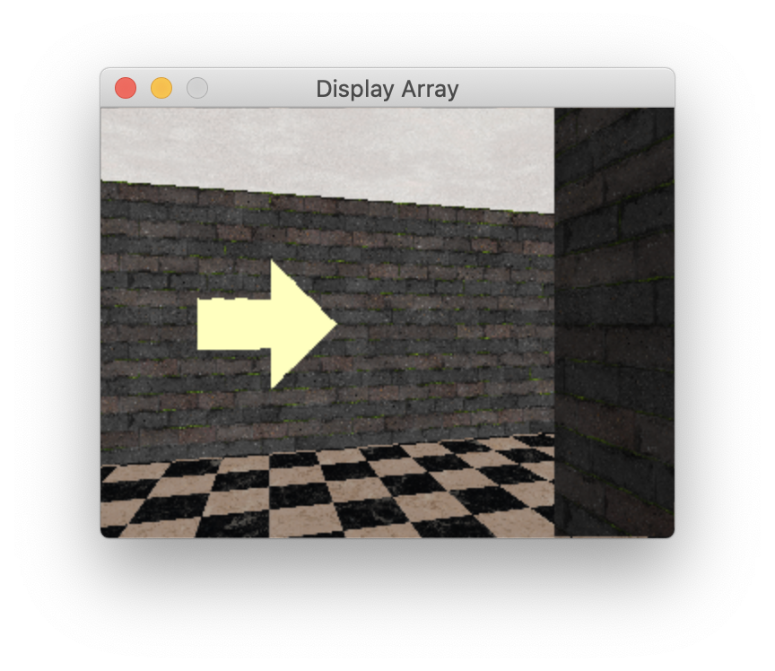

# Title: Robot Maze Navigation in Simulation

## Project Description

## Project Goals

1. Create a dataset for training a NN for navigation.
2. Explore methods for adding "noise" to the dataset.
3. Train a NN that is able to navigate any procedurally generated maze.
